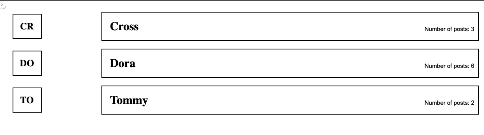
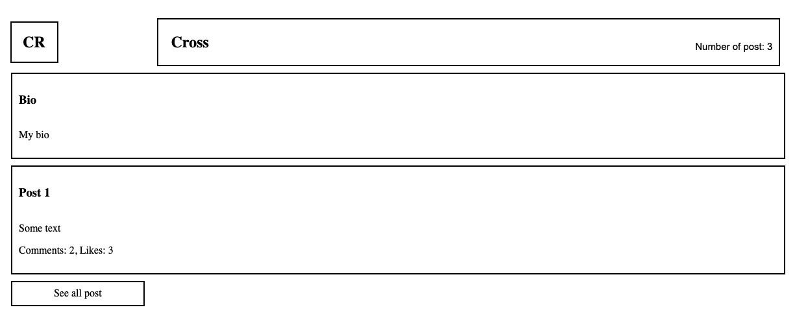
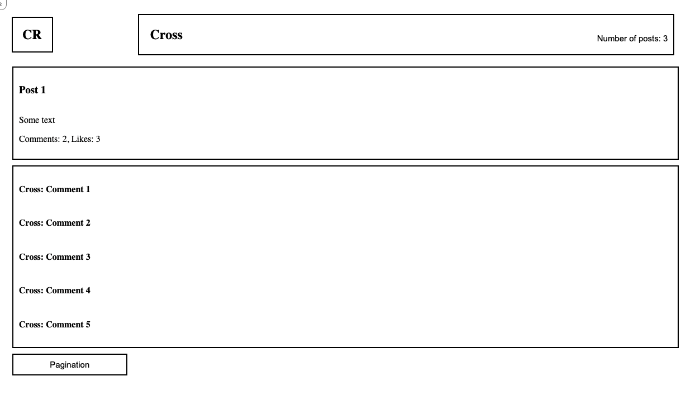
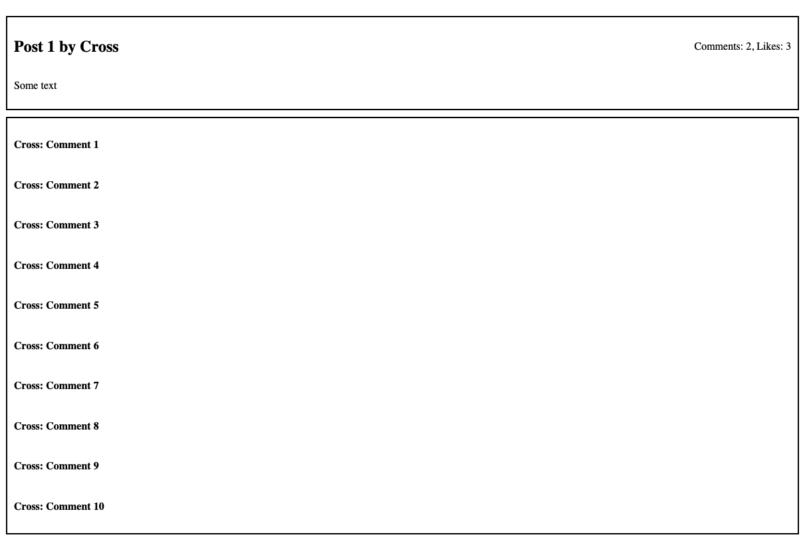

# Blog App

> Blog app is a fully functional website that will show the list of posts and empower readers to interact with them by adding comments and liking posts





 

### Milestone 1:

- Create routes.
- Create action in the correct controller.
- Create a view file.

### Milestone 2:

- Add RSpec as a gem.
- Create a Request spec file for controllers.
- Test each action performed.

### Milestone 3:

- Build project schema.
- Create and run migration files.
- Add table and column names based on ERD diagram.

### Milestone 4:

- Create model classes for entities in the ERD.
- Set up association between models.
- Make currenty data available to all controllers.

## Milestone 5:

- Use preprocessed HTML file with embedded Ruby code.
- Use layouts and templates for shared content
- Implement the design from the sneak peek wireframes.

## Milestone 6:
- Create forms to perform the following functions:
- Creates a Post on behalf of the current_user.
- Create a comment on behalf of the current_user.
- Allow Users to add likes to Posts.

## Milestone 7:
- Add validations for user and post models.
- Add unit specs for all models' methods and validations.
- Add flash messages in the create actions in controllers.
- Make sure that the N+1 problem is solved when fetching all posts and their comments for a user.

## Milestone 8:
- Install and setup devise.
- Add functionality to register users.
- Allow users to login with email and password.
- Add functionality to confirm email and reset password.

## Built With
- Ruby
- Ruby on rails

## Getting Started

To get a local copy up and running:

* Clone this repo with:

    ```bash
    git clone https://github.com/Ghiftee/blogapp
    ```

* Navigate to the folder/directory

    ```bash
    cd blogapp
    ```

## Run
- bundle install
- rails webpacker:install
- rails db:schema:load
- rails db:seed
- rails s

## Tests
- After cloning run bundle install
- Then run rails webpacker:install to install webpack dependencies
- Run bundle install again
- Finally, run bundle exec rspec to see the tests pass

## Author

👤 **Gift Uwhubetine**

- GitHub: [@Ghiftee](https://github.com/ghiftee)
- Twitter: [@Ghiftee](https://twitter.com/i_ghiftee)
- LinkedIn: [Ghiftee](https://linkedin.com/in/giftuwhubetine)

👤 **Akasha Rojee**

- GitHub: [@Ghiftee](https://github.com/AkashaRojee)
- Twitter: [@Ghiftee](https://twitter.com/AkashaRojee)
- LinkedIn: [Ghiftee](https://linkedin.com/in/AkashaRojee)

## 🤝 Contributing

Contributions, issues, and feature requests are welcome!

Feel free to check the [issues page](../../issues/).

## Show your support

Give a ⭐️ if you like this project!

## 📝 License

This project is [MIT](./MIT.md) licensed.